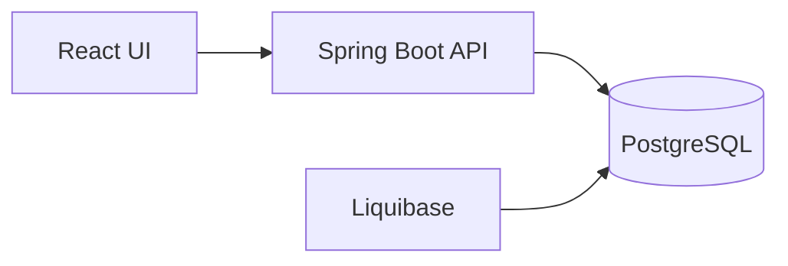

# Financial-Intelligence
A personal finance app I built for tracking spending, updating budgets, and keeping an eye on what’s left to spend.

# Dependencies
Java >= 21
Docker

# Running the Application

```
git clone https://github.com/CollinDonnan/Financial-Intelligence.git

cd Financial-Intelligence

docker compose up
```

# Tech Stack

Backend - Spring Boot

Frontend - React

Database - PostgreSQL, Liquibase

Deployment - Docker

Testing - Mockito, Vitest

Documentation - Swagger

# Features

- Add transactions
- Delete transactions
- Update transactions
- Update budget amounts
- Calculate remaining budget totals
- Track personal spending in a simple, easy-to-use interface

# Planned Features

- Transaction categories
- Credit card optimization
- Stock tracking

# Architecture

The frontend sends requests to the Spring Boot API, which handles the business logic and interacts with the PostgreSQL database. Liquibase manages the database migrations, and Docker keeps the app easy to run locally.



# Documentation

API docs are available at:

http://localhost:8081/v3/api-docs

